# gtheme

**Change how your desktop looks — safely.**

<p align="center">
  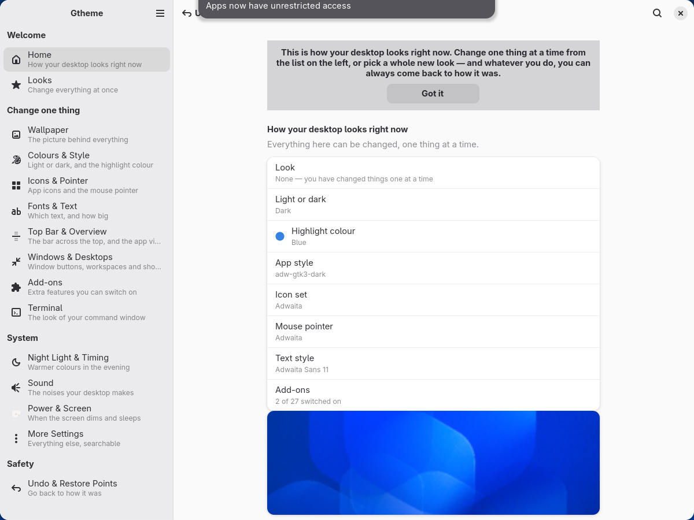
</p>

<p align="center">
  
  
  
</p>

---

## 🆘 Something looks wrong? Put it back

Three ways, from easiest to most stubborn. Any one of them is enough.

1. **In the app** — press **Ctrl+Z**, or click **Undo last change** at the top
   of the window. Or open **Undo & Restore Points** in the list on the left and
   pick the moment you want back, including *Before gtheme* — how your desktop
   looked before this app ever ran.
2. **The app won't open, but the desktop works** — open a terminal window
   (hold **Ctrl**, **Alt** and press **T**; if that does nothing,
   [docs/start-here.md](docs/start-here.md) shows another way) and type:

   ```sh
   gtheme rescue
   ```

   That puts every setting and file gtheme touched back the way it was, and
   switches off every add-on gtheme switched on. It needs no window, no mouse,
   and no graphics at all.
3. **The screen is unusable — no bar, no windows, nothing responds** — hold
   **Ctrl** and **Alt** and press **F3**. You get a black screen with a text
   prompt. Type your username, press Enter, type your password (nothing appears
   as you type — that is normal), press Enter, then type `gtheme rescue` and
   press Enter. When it says it is done, hold **Ctrl** and **Alt** and press
   **F2** to get back to your desktop — on some systems it is **F1** instead,
   and trying both is harmless. Then log out and back in.

You do not have to reinstall anything, and nothing is deleted by any of the
three.

---

## What is this?

gtheme is an app for the GNOME desktop that changes how your computer looks —
the background picture, the colours, the icons, the mouse pointer, the text,
the bar across the top, and the small extras GNOME calls add-ons.

Today those things live in four different apps, three of which talk to you in
words you would have to look up, and none of which can put anything back. This
one puts them in a single window, explains every switch in a sentence, and
saves how your desktop looked before it changes anything.

If you have used Windows or a Mac and this is your first Linux computer: you
are the person this was written for. Nothing here needs the command line, and
nothing here can be broken so badly that the **Undo** button cannot fix it.

## Contents

- [Put it back](#-something-looks-wrong-put-it-back)
- [What is this?](#what-is-this)
- [What you need](#what-you-need)
- [Install](#install)
- [The first time you open it](#the-first-time-you-open-it)
- [What's in the app](#whats-in-the-app)
- [Questions people ask](#questions-people-ask)
- [Words you might not know](GLOSSARY.md)
- [For people who want to help](#for-people-who-want-to-help)

## What you need

| | |
|---|---|
| **A GNOME desktop, version 49 or 50** | This is the desktop Fedora, Ubuntu and Arch ship by default. If your screen has a bar across the very top with a clock in the middle, that is probably GNOME. gtheme checks when it starts and says so plainly if it is somewhere else — it never half-works. |
| **libadwaita 1.9 or newer** | One of the building blocks GNOME itself is made of. GNOME 49 and 50 both include it; there is nothing separate to install. On an older GNOME the window will not open, and gtheme tells you that instead of misbehaving. |
| **Python 3.11 or newer** | Already on every desktop Linux system in use today. |
| **About 60 MB of disk space** | Three quarters of that is the pictures the four built-in Looks use. |

gtheme does **not** need an internet connection to change anything on your
computer. It only goes online if you ask it to look for new add-ons or new
Looks, and it says so when it does.

## Install

Pick the row that sounds like you.

| You | Go to |
|---|---|
| "I have no idea what any of this means." | [The easy way](#the-easy-way) |
| "I use Arch Linux / CachyOS / EndeavourOS." | [The Arch way](#the-arch-way) |
| "I want to work on gtheme itself." | [CONTRIBUTING.md](CONTRIBUTING.md) |

There is deliberately no "paste this one line into a terminal and it downloads
and runs a script" command anywhere in this project. That is a popular way to
install things and a bad habit to teach: it asks you to run code you have not
seen, from a web address you cannot check, as a matter of routine. The steps
below let you look at what you downloaded first.

### The easy way

**1. Download it.**
Open <https://github.com/blyatiful1/gtheme> in your web browser. Click the
green **Code** button near the top right, then click **Download ZIP**. Your
browser saves it to your **Downloads** folder.

**2. Unpack it.**
Open your **Files** app, go to **Downloads**, right-click `gtheme-main.zip` and
choose **Extract Here**. A folder called `gtheme-main` appears next to it.

**3. Look inside if you like.**
Everything gtheme installs is in that folder, in plain text you can read. The
file `install.sh` is the one the next step runs, and it is short enough to read
in a couple of minutes.

**4. Run the installer.**
Right-click the `gtheme-main` folder and choose **Open in Terminal**. (No such
menu entry? [docs/start-here.md](docs/start-here.md#opening-a-terminal) shows
two other ways.) A window with a text prompt opens. Type this and press
**Enter**:

```sh
./install.sh
```

It checks that the pieces it needs are present, sets itself up in its own
private corner of that folder so it cannot disturb anything else on your
system, and adds **Gtheme** to your list of applications. It prints what it is
doing as it goes. If something is missing it stops and tells you the exact
command to install it — it never installs system packages behind your back.

**5. Open it.**
Press the **Super** key (the one with the Windows logo on most keyboards),
type `gtheme`, and press **Enter**.

To remove it later, see [Can I remove it?](#can-i-remove-it) below.

### The Arch way

The folder contains a `PKGBUILD`, so on Arch and its relatives:

```sh
git clone https://github.com/blyatiful1/gtheme
cd gtheme
makepkg -si
```

That builds a normal package and installs it with `pacman`, which means
`pacman -R gtheme` removes it completely later. Dependencies are declared in
the `PKGBUILD`; `makepkg -s` pulls them in.

## The first time you open it

The first time — and only the first time — gtheme shows four short cards.

1. **Change how your desktop looks.** What the app is for.
2. **You can always go back.** The important one: *before anything changes,
   gtheme saves how your desktop looks right now. One click puts it back.*
3. **Two ways to work.** Pick a whole look at once, or change one thing at a
   time from the list down the side.
4. **Save how it looks now.** One button, and it does a real thing: it saves
   your desktop exactly as it is at this moment, so you have somewhere to
   return to before you have changed anything at all.

You can skip it, and you can bring it back any time from the **☰** menu at the
top of the window → **Show the introduction again**.

Two things worth knowing from the start:

- **Ctrl+F searches everything** — every setting, every explanation, every
  Look, every add-on, in the words you would actually use. Type "taskbar",
  "make text bigger" or "dark mode" and it takes you to the row and flashes it.
  You never have to learn where things live.
- **Ctrl+Z undoes the last change**, from anywhere in the app.

## What's in the app

Fifteen pages, in four groups down the left-hand side. Every screenshot below
is the real app, photographed by the test suite on the run that shipped this
version — not a mock-up.

### Welcome

#### Home


Reads your desktop back to you in plain words: which Look is on, light or dark,
your highlight colour, your icons, your pointer, your text, how many add-ons
are switched on, and a picture of your background. Nothing here is a control —
it is the page that answers "what have I actually got?", which no other GNOME
app can tell you. The two safety buttons live here too.

#### Looks

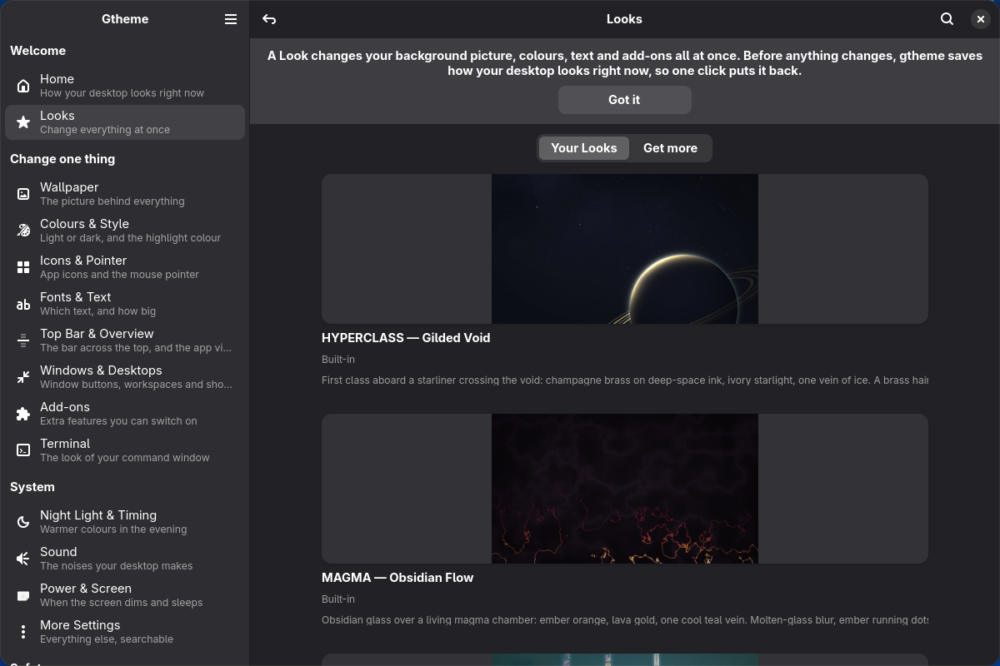

A Look changes your background, colours, icons, text and add-ons all at once.
Four are built in — HYPERCLASS, MAGMA, NETRUNNER and NIGHTBLOOM — and **Get
more** lists what the community has published.

Clicking one does not apply it. It opens a dialog that says, in your words,
what is about to change ("Wallpaper, highlight colour, icons, and 3 add-ons").
Only then does it run, as one all-or-nothing operation: if any part of it
fails, the whole thing is rolled back and you are told what happened. A saved
moment is taken automatically first, and the message afterwards has an **Undo**
button in it.

You can also save your own desktop as a Look and share it. gtheme scans what it
captured for anything private — your username in a file location, a key some
add-on stored — and shows you what it found before you send it anywhere.

### Change one thing

#### Wallpaper

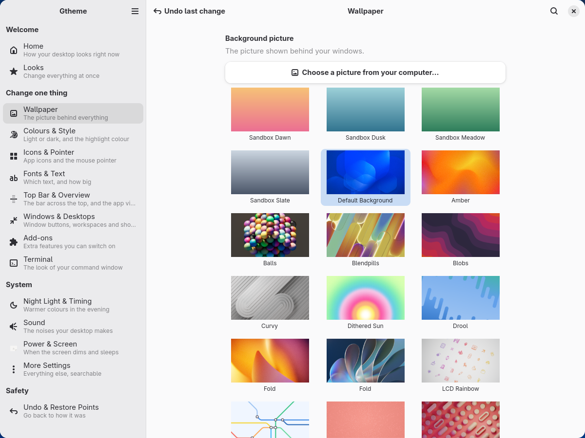

Two separate grids: the picture for your light look, and the picture for your
dark look. GNOME's own picker ties those together; gtheme does not, so you can
have a completely different picture in the evening. Pictures that change during
the day are labelled as such. You can add your own — gtheme copies it somewhere
safe rather than pointing at a file you might later move.

#### Colours & Style

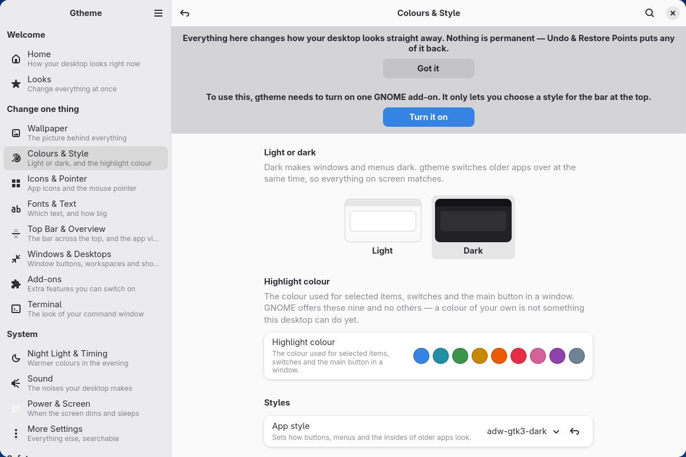

Light or dark as two tiles you look at, not a switch you read. The highlight
colour as nine coloured dots — the control *is* the preview. GNOME offers
exactly those nine and no way to add a tenth, and the page says so out loud
rather than leaving you hunting for a colour wheel that does not exist.

The light/dark tile writes two settings at once, together or not at all. That
is the classic split-brain bug — a dark desktop full of blinding white
windows — and it is impossible here by construction.

Also here: the style for the insides of windows, the style for the bar at the
top, stronger colours for readability, and less on-screen movement.

#### Icons & Pointer

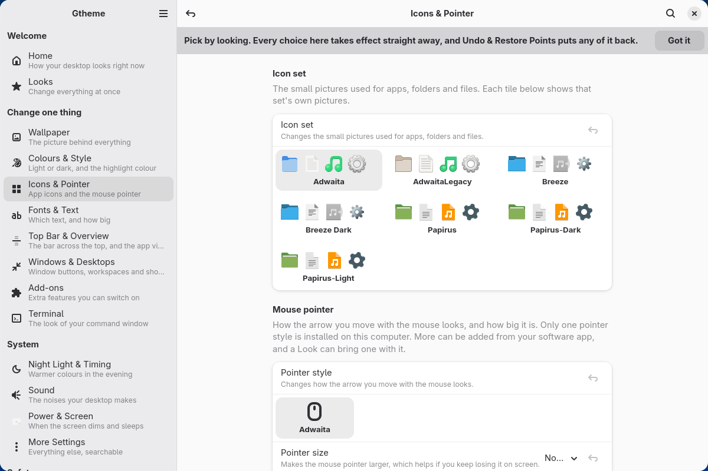

Icon sets are shown as a row of their own actual icons. A name in a dropdown
tells you nothing about what you are about to get. Pointer styles are tiles
with a size choice; the page admits that a pointer cannot be drawn from inside
an app, and that most computers have exactly one installed, rather than looking
broken and saying nothing.

#### Fonts & Text

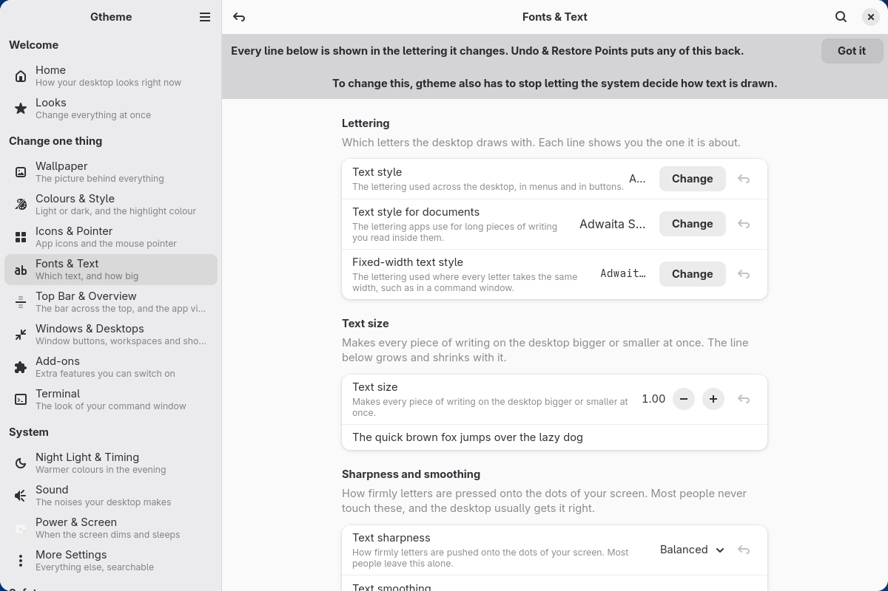

Every choice is shown in the lettering it is about. Text size, and a "text
sharpness" choice with three samples — Softer, Balanced, Sharper — instead of
the two words GNOME uses that read like physics. Two settings here do nothing
until a second setting is changed first; gtheme writes both, in one operation,
and tells you it is doing it rather than leaving you with a control that
visibly moves and changes nothing.

#### Top Bar & Overview

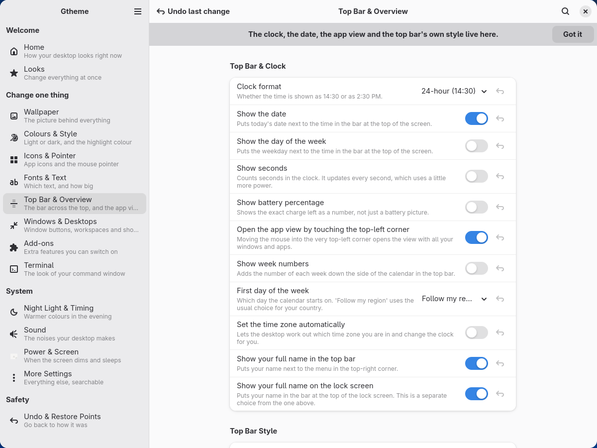

The bar across the top and the view you get when you press Super: what the
clock shows, whether the weekday and the battery percentage appear, the
top-left corner shortcut, and the style of the bar itself.

That last one needs a GNOME add-on switched on. When it is off, the page does
not say "user-theme extension not enabled" and leave you to search the web —
it says what you cannot do and offers the button that fixes it.

#### Windows & Desktops

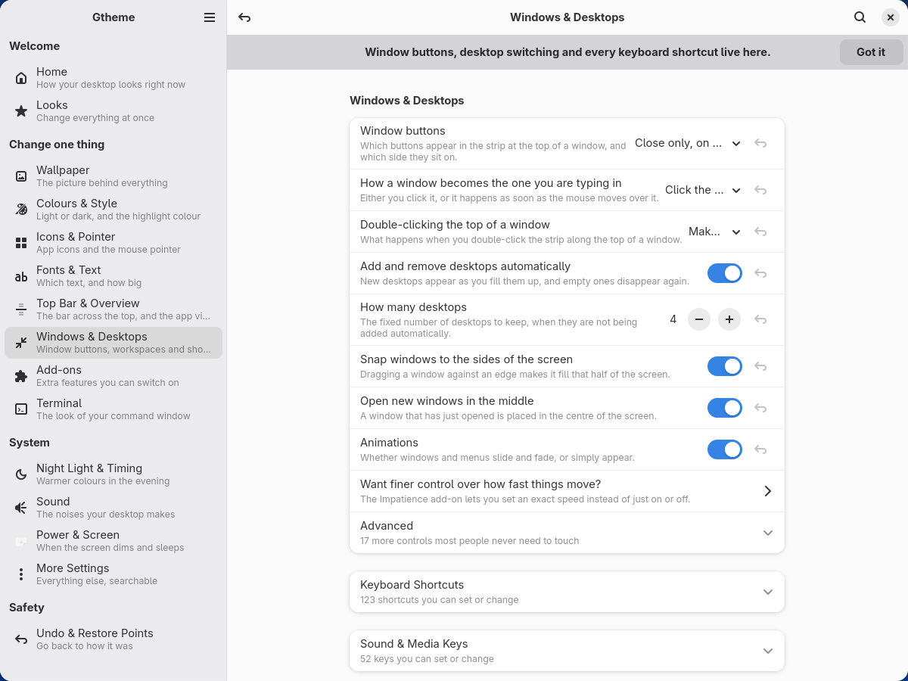

Where the close/minimise/maximise buttons go, what double-clicking a window's
top bar does, how windows take focus, and how many desktops you have. Every
keyboard shortcut the desktop itself watches for is here too, in two collapsed
groups — 175 of them, which is why they are folded away rather than dumped in
a list.

#### Add-ons

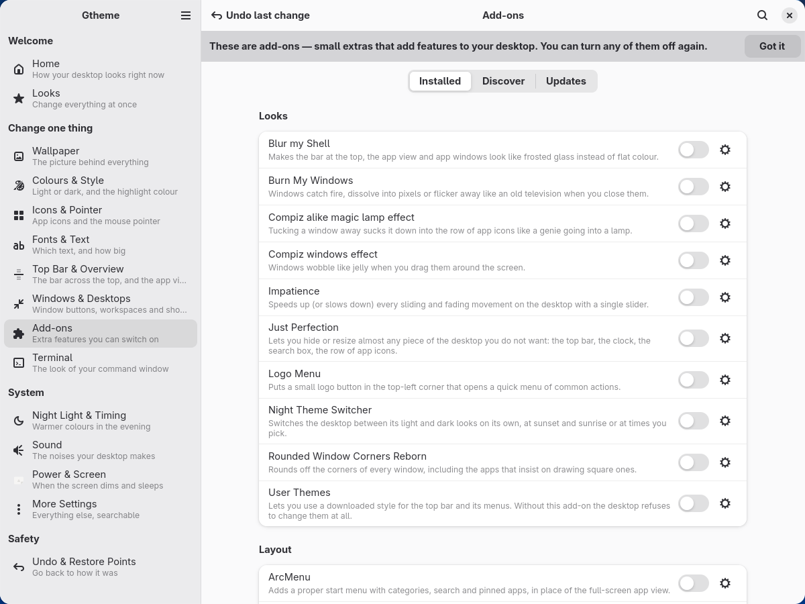

Add-ons are small extras that add features to your desktop. Three views:
**Installed** with a switch each, **Discover** to search the online library,
and **Updates**.

- Every add-on gets a sentence saying what it does, in plain words. Their
  internal identifiers are never shown anywhere in gtheme.
- Twenty-four popular add-ons have a hand-written settings panel, so their
  options are explained the same way everything else in the app is. The rest
  get an honest generic panel labelled "these settings come from the add-on
  author".
- Add-ons that fight each other (two docks, two clipboard managers) are offered
  as either/or, with an offer to switch the other one off.
- Combinations known to break things carry a warning that says what will
  happen to you, not what will happen internally.
- Installing goes through GNOME's own confirmation box — gtheme never installs
  an add-on behind it.

#### Terminal

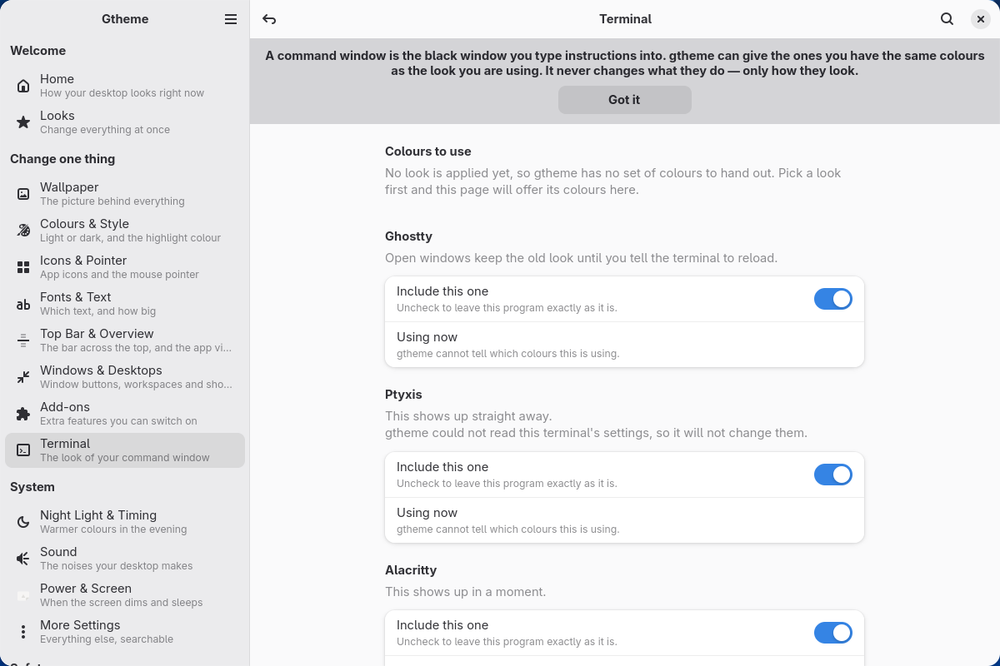

If you use a terminal, gtheme can give it, its prompt and its little status
tools the same colours as your Look. One card per program that is *actually
installed* — a list of eight with seven greyed out is a list of things you
cannot do.

Each card says honestly when you will see the change: some terminals update
while you watch, some within a second, some only when you open a new window.
And if a program's settings are being managed by some other tool, gtheme
refuses to write, says so, and offers to take over — a deliberate act, and an
undoable one.

### System

#### Night Light & Timing

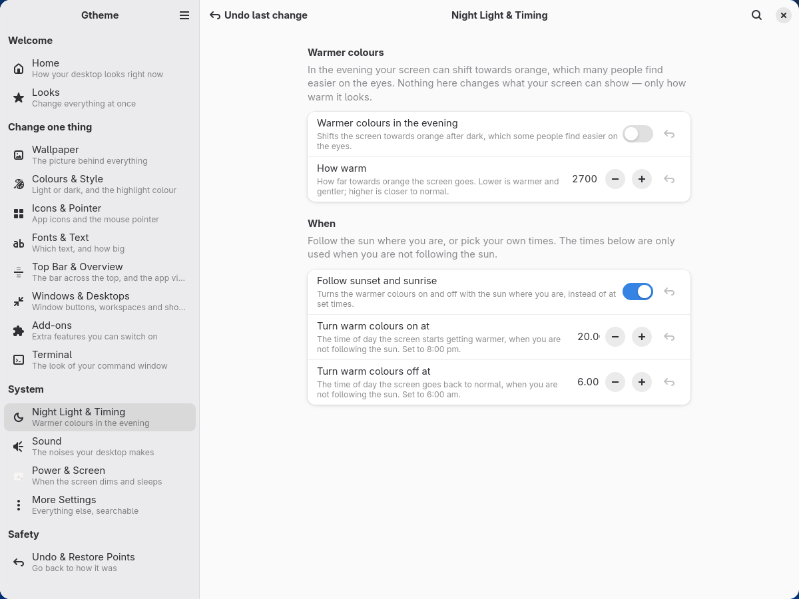

Warmer colours in the evening, on the sun's schedule or on yours. GNOME stores
those times as fractions of an hour — `20.25` — so the page shows you "Set to
8:15 pm" underneath and follows the slider as it moves.

#### Sound

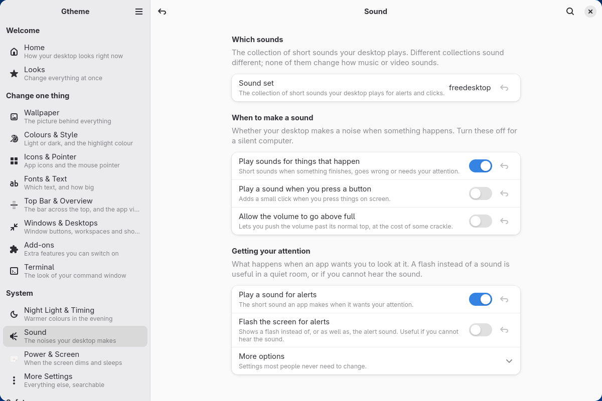

Which set of short sounds your desktop plays, whether it plays them at all, and
whether it beeps.

#### Power & Screen

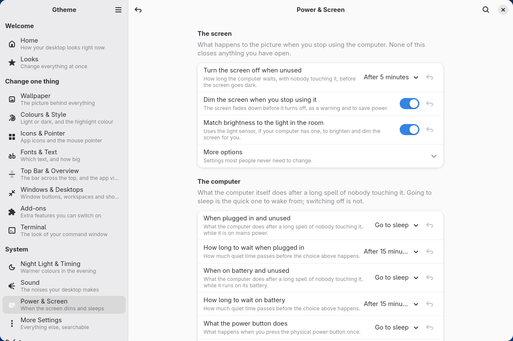

When the screen dims, when it turns off, when the computer sleeps, and whether
it asks for a password afterwards. Grouped by the question you are actually
asking, not by which part of GNOME happens to own the setting. It warns you
about one combination people pick by accident and then find maddening: screen
off after a minute, lock immediately.

#### More Settings

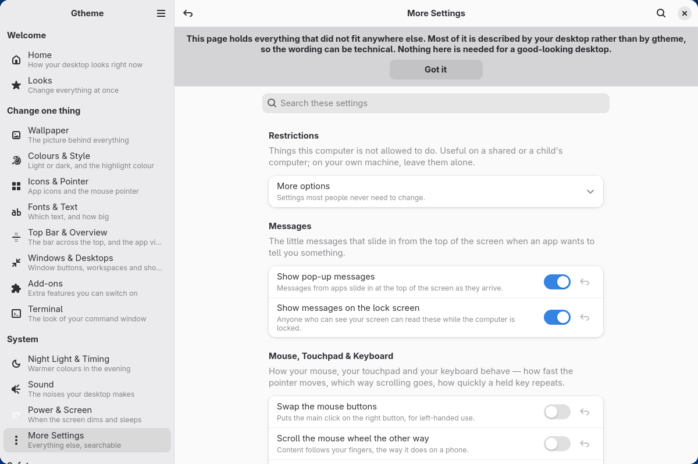

Everything the fourteen other pages did not put a hand-written row on. It is
generated, not written: every setting a GNOME 50 desktop has is accounted for
in a list the test suite checks, and anything with no home lands here
automatically, described in the system's own words and clearly labelled as
such.

This is what makes "nothing was left out" a fact rather than a claim. If gtheme
can see a setting, you can find it.

### Safety

#### Undo & Restore Points

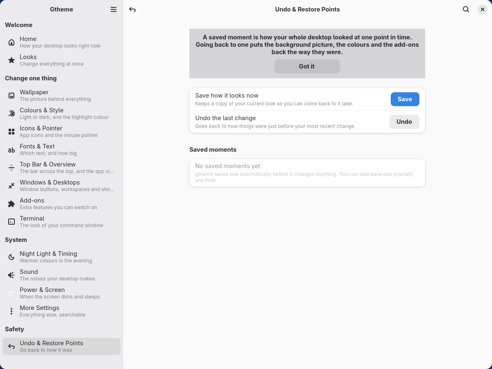

The page that makes the rest of the app safe to touch, and the one thing no
other GNOME customisation tool has.

A **saved moment** is how your whole desktop looked at one point in time. One
is taken automatically before anything changes, you can take one whenever you
like, and going back to one puts the background, the colours, the text and the
add-ons back the way they were. They are dated in words — "My desktop, 25
August" — never in a timestamp.

At the bottom, on its own, sits **Before gtheme**: how this computer looked
before this app ever ran. That one is never deleted and never pruned.

## Questions people ask

### Will this break my desktop?

Not permanently, and it is designed so that it cannot.

- **Nothing is applied that you have not seen first.** Every Look shows you
  what it is about to change, in your words, before it changes it.
- **Everything is saved first.** Before the first byte moves, gtheme records
  exactly what was there. That recording is written as it goes, so even a power
  cut halfway through leaves a complete record of what had changed by then.
- **Changes are all-or-nothing.** If any step of applying a Look fails, the
  whole thing is rolled back. gtheme never leaves you with a half-changed
  desktop.
- **The first record is never overwritten.** The first time gtheme touches
  anything it writes down what was there and never writes over that, however
  many Looks you try afterwards. "Before gtheme" still means before gtheme, a
  year later.
- **Looks cannot run programs.** See [SECURITY.md](SECURITY.md).

The honest limits: a badly-behaved *add-on* — third-party code, published by
someone else, that GNOME loads into your desktop — can still misbehave, and
that is true whether you install it through gtheme, through GNOME's own app, or
from a website. gtheme's answer is that it always knows which add-ons it
switched on, so `gtheme rescue` can switch them all back off without the
desktop's help.

### Can I remove it?

Yes, and it leaves nothing behind.

Before you uninstall, open **Undo & Restore Points** and go back to **Before
gtheme**. That returns every setting and file gtheme ever touched to its
original state. (You can also do it from a terminal with `gtheme rescue`.)

Then:

- **Installed the easy way** — everything gtheme put on your computer is the
  folder you unpacked, plus two entries it added outside it: `~/.local/bin/gtheme`
  (what makes the `gtheme` command work) and a `Gtheme` entry under
  `~/.local/share/applications` (what makes it appear in your app list). Delete
  the folder and those two, and it is gone.
- **Installed with `makepkg -si`** — `sudo pacman -R gtheme`.

gtheme's own saved moments live in `~/.local/state/gtheme/v2` and are yours to
delete once you no longer want them.

### Why does an add-on need me to log out?

Because of how GNOME itself works, and gtheme will not pretend otherwise.

Your desktop looks for add-ons in its folders **once**, when it starts. An
add-on that arrives after that is invisible to it — there is no way to make it
look again. This is not a gtheme limitation; it was measured directly against
GNOME 50 and the test suite still checks it on every full run, so that if a
future GNOME changes it, gtheme notices.

So there are two cases and gtheme tells you which one you are in:

- An add-on already on your computer can be switched on right now. "It's on."
- An add-on gtheme has just downloaded usually starts working immediately,
  because GNOME's own installer loads it for you. When it cannot, gtheme says
  "it starts working after you log out and back in" — and means it.

Those two sentences differ by one clause and by the entire question of whether
the app is telling you the truth.

### Does it send anything anywhere?

No. gtheme has no account, no server and no telemetry. It talks to the internet
in exactly two situations, both of which you start: searching the add-on
library at extensions.gnome.org, and fetching the list of community Looks —
which is one public file published with gtheme's own code, because there is no server
to run.

If you publish a Look, gtheme scans it first for anything private and shows you
what it found before you share it.

### Why is something greyed out?

Because it would not do anything, and gtheme would rather tell you than let you
press it. Every greyed-out control carries the reason: the add-on that owns it
is switched off, the program is not installed, or another setting has to change
first.

### Can I use it on Ubuntu or Fedora?

If it is running GNOME 49 or 50, yes. To find out, open your **Settings** app
and look at **System → About** — it prints the GNOME version there.

Older releases ship an older libadwaita than gtheme needs. On one of those,
gtheme shows a screen saying so and changes nothing, rather than opening a
window that half-works. gtheme was built and tested on Arch; the easy-way
installer is written to work anywhere and says exactly what is missing if it
does not.

### Where did the old command-line gtheme go?

Nowhere. v1 is preserved in full on the
[`legacy-v1`](https://github.com/blyatiful1/gtheme/tree/legacy-v1) branch and at
the [`v1-final`](https://github.com/blyatiful1/gtheme/releases/tag/v1-final)
tag. See [CHANGELOG.md](CHANGELOG.md) for what changed and why.

## For people who want to help

- **New to all of this?** [docs/start-here.md](docs/start-here.md) — what a
  Linux system is, how to open a terminal, and how to copy and paste into one.
- **A word you do not know?** [GLOSSARY.md](GLOSSARY.md).
- **Want to add a Look, an add-on panel, or a setting?**
  [CONTRIBUTING.md](CONTRIBUTING.md). Most contributions are data files, not
  code.
- **Writing a Look?** [docs/preset-format.md](docs/preset-format.md).
- **Want to know how it works inside?**
  [docs/architecture.md](docs/architecture.md) and
  [docs/testing.md](docs/testing.md).
- **Found a security problem?** [SECURITY.md](SECURITY.md).

## Licence

MIT — see [LICENSE](LICENSE). Copyright © 2026 blyatiful1.
