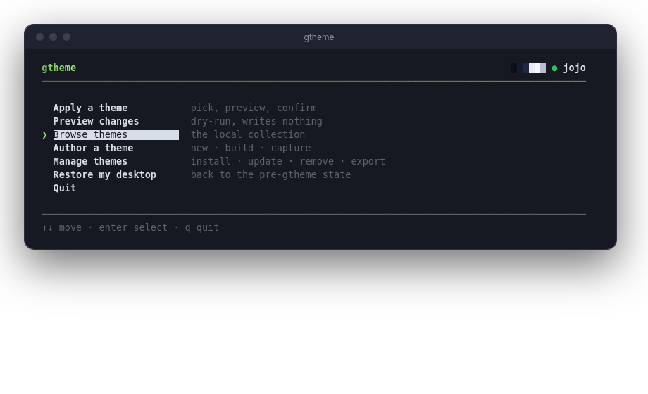
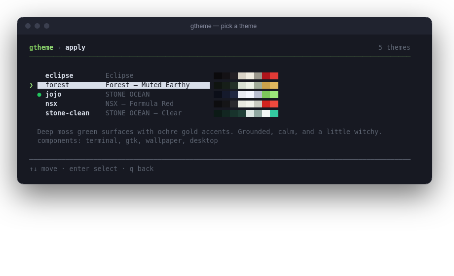

# gtheme — a GNOME theme manager

[](https://github.com/blyatiful1/gtheme/actions/workflows/ci.yml)
[](https://pypi.org/project/gtheme/)


**Download, apply, switch, and author** full-desktop GNOME themes from a
single palette — wallpaper, GTK, terminal, prompt, editor, monitor, the lot.
One declarative manifest per theme; gtheme snapshots everything it touches,
so **`gtheme restore` always brings back your exact pre-gtheme desktop**. No
hand-written undo scripts, no half-reverted configs.

<p align="center">
  
</p>

```sh
gtheme                    # ← just run it: an interactive arrow-key menu
gtheme apply nsx          # back up current state, apply the NSX theme
gtheme switch jojo        # swap themes (your pre-gtheme baseline is kept)
gtheme restore            # revert to the desktop you had before gtheme
```

## Requirements

- **GNOME 47+** (Wayland or X11) — on other desktops gtheme warns and asks
  before touching anything
- **Python 3.11+** with `jinja2` and `pydantic` (v2)
- `gsettings`/`dconf` (ship with GNOME), `git` only for installing themes
  from URLs

## Install

**Easiest — pipx** (works on every distro, no dependency puzzles):

```sh
sudo apt install pipx        # Ubuntu/Debian   (Fedora: sudo dnf install pipx)
pipx install gtheme          # or, before the PyPI release:
pipx install git+https://github.com/blyatiful1/gtheme
```

**From a checkout** (contributors, or if you prefer git):

```sh
git clone https://github.com/blyatiful1/gtheme ~/gtheme
~/gtheme/install.sh --pip    # checks deps; sets up a private venv if needed
```

The installer explains anything that's missing (including the exact commands
for apt/dnf/pacman) and how to put `~/.local/bin` on your PATH if it isn't.
Keep the cloned folder around — the installed command runs from it.

Distro packages for the dependencies, if you'd rather use them:

```sh
sudo apt install python3-jinja2 python3-pydantic   # Debian 13+/Ubuntu 25.04+ (older apt ships pydantic v1 — use pipx there)
sudo dnf install python3-jinja2 python3-pydantic   # Fedora
sudo pacman -S python-jinja2 python-pydantic       # Arch (a PKGBUILD is also included)
```

## The interactive menu

Run `gtheme` with no arguments and you get a full-screen arrow-key menu that
reaches every command — apply/switch with dry-run preview, restore, browse,
author (new/build/capture), and manage (install/update/remove/export/
validate/search). Theme pickers show live palette swatches and a description
panel; the header wears your applied theme's accent colours.

<p align="center">
  
</p>

Move with `↑`/`↓` (or `j`/`k`), `enter`/`→` to select, `q`/`esc`/`←` to go
back, `1`-`9` to pick directly. It's pure stdlib — no `rich`, no `curses` —
runs on the alternate screen (your scrollback survives), adapts to any
terminal size, and honours `NO_COLOR`. Without a TTY it degrades to a plain
numbered prompt; set `GTHEME_PLAIN=1` or pass `--plain` to force that mode on
a real terminal too (screen-reader friendly).

## How a theme works

A theme is a directory with a declarative `theme.toml`:

```toml
[meta]
name = "jojo"
title = "STONE OCEAN"

[palette]                       # or a separate palette.toml
bg = "#0B0E18"
accent = "#7DC75B"
# ...

[[files]]                       # component tag drives --only and per-file backup
component = "gtk"
src  = "files/gtk/gtk.css"
dest = "~/.config/gtk-4.0/gtk.css"

[[settings]]                    # gsettings or dconf; value is GVariant text
component = "desktop"
backend = "gsettings"
key   = "org.gnome.desktop.interface accent-color"
value = "'green'"

[[settings]]                    # {{ runtime }} tokens resolve per-machine
component = "terminal"
backend = "dconf"
key   = "/org/gnome/Ptyxis/Profiles/{{ ptyxis_default_profile }}/palette"
value = "'JoJo'"

[[hooks]]                       # optional scripts for the weird 10%
event = "post"
component = "extras"
script = "hooks/setup.sh"
optional = true
```

Layout:

```
themes/<name>/
  theme.toml        palette.toml
  files/            # sources referenced by [[files]].src
  assets/           # non-installed extras (svg sources, etc.)
  hooks/            # scripts referenced by [[hooks]]
```

`schema/theme.schema.json` gives you editor validation/completion for
`theme.toml` (taplo / the *Even Better TOML* VS Code extension).

### Backup & restore (the safety net)

The first time gtheme touches a file or a settings key, it snapshots the
prior value into a **pristine baseline** under `~/.local/state/gtheme/`.
Apply and switch as much as you like — `gtheme restore` always returns the
system to the state it had *before gtheme first ran*: files the themes
introduced are removed (including now-empty directories), overwritten files
and settings come back byte-for-byte. After a successful full restore the
baseline is consumed, so the next apply re-snapshots your (possibly edited)
configs instead of pinning stale copies.

Concurrent runs are locked out, interrupted applies stay recoverable, and
`apply --only <component>` layers a single component without un-theming the
rest of your desktop.

`{{ runtime }}` tokens (`ptyxis_default_profile`, `home`) resolve at apply
time, so manifests committed to the repo are portable across machines.

## Authoring: a palette becomes a desktop

```sh
gtheme new ocean --from jojo     # scaffold, seeding the palette from jojo
$EDITOR ~/.local/share/gtheme/themes/ocean/palette.toml
gtheme build ocean               # render alacritty/ptyxis/btop/micro/gtk from it
gtheme apply ocean --dry-run     # preview every file + setting change
gtheme apply ocean
```

`build` renders the components listed in `[build].managed` from shared Jinja
templates (`src/gtheme/templates/`), with filters like `lighten`, `darken`,
`mix`, `alpha`. Define the structural roles and the 6 ANSI hues; brights and
surfaces are derived when omitted.

### Palette roles

| role | required? | notes |
|---|---|---|
| `bg`, `fg`, `accent` | recommended | everything else can derive from these |
| `surface1..3`, `fg_dim`, `fg_bright`, `accent_bright`, `selection`, `comment`, `cursor` | derived | override to taste |
| `red green yellow blue magenta cyan` | recommended | ANSI hues; `bright_*` variants derive |
| `ansi_black`, `ansi_white`, `bright_black`, `bright_white` | derived | |

Other `[[files]]` fields worth knowing: `template = true` runs the source
through `{{ }}` substitution at apply time; `mode = "755"` sets permissions;
a *pre* hook that fails aborts the whole apply, `optional = true` hooks only
warn. If your palette is dark, set the `color-scheme` gsetting to
`'prefer-dark'` — your users may be in light mode.

Already themed your desktop by hand? Freeze and share it:

```sh
gtheme capture mydesk            # snapshot the FULL live look into a theme
gtheme export mydesk             # bundle it into a shareable mydesk.zip
gtheme install mydesk.zip        # (on the other machine)
```

`capture` records the GNOME interface settings (accent, color-scheme,
icon/GTK/cursor themes, fonts), the wallpaper (bundled and made portable),
terminal/prompt/shell/monitor/editor configs *and* the theme files they
reference (Ptyxis palettes, btop themes, alacritty imports), plus every
supported extension's settings. It warns you about anything that looks like
a secret or a machine-specific path before you share the result.

## Commands

| command | what it does |
|---|---|
| `list` / `search <q> [--remote]` | browse locally, or search the online collection |
| `install <name\|path\|.zip\|git-url>` | install a theme (collection, local dir, .zip, or repo) |
| `remove <name>` / `update [name]` | uninstall, or refetch from the recorded origin |
| `diff <name>` / `apply <name> --dry-run` | preview changes without writing |
| `apply <name> [--only c1,c2] [-y]` | apply (`--no-sudo` / `--no-hooks` to skip hooks) |
| `switch <name>` | alias of apply — the pristine baseline is kept either way |
| `restore [--only c1,c2] [--wipe] [-y]` | revert to the pre-gtheme state |
| `current` / `validate [name]` | show the active theme; check a manifest |
| `new <name> [--from base]` / `build <name>` | author from a palette |
| `capture <name>` / `export <name>` | freeze the live desktop; bundle a .zip |
| `publish <name>` / `index` | add to the collection + regenerate its index |

Global flags: `--version`, `--verbose`, `--plain`. Commands that change
things take `-y`/`--yes` (assume yes — non-interactive/CI use). Run
`gtheme <command> --help` for the details.

## Security & consent

Themes can ship `[[hooks]]` (arbitrary shell scripts) and write files across
your home directory, so gtheme treats anything you downloaded as untrusted:

- **Every hook is previewed and individually confirmed** before it runs;
  `--yes` approves them all (only for themes you trust). Trusted, non-sudo
  hooks from your own local themes run without prompts.
- Themes installed from a **git URL or .zip** are marked untrusted; their
  hooks are denied by default in non-interactive runs.
- **File destinations are confined** to your home directory; theme sources
  are confined to the theme's own directory; exports refuse to follow
  symlinks out of the theme. Path escapes (`/etc/...`, `~/../...`) are refused.
- `--insecure` (allow `http://` origins) and `--allow-unsafe` (install
  despite failed validation) exist for development; leave them off.

Found a boundary escape? See [SECURITY.md](SECURITY.md).

## The collection

| | theme | |
|---|---|---|
|  | **nsx** | Honda NSX (NA1): Berlina-black cabin, Formula Red, Championship White |
|  | **jojo** | STONE OCEAN (JoJo Part 6+): Jolyne green, Stand-string blue, the Spin |
|  | **shoji** | Paper & Ink: washi paper, sumi ink, one vermilion hanko — a light-mode rice |

Contribute yours: `gtheme publish <name>` prints the exact PR steps, and
[CONTRIBUTING.md](CONTRIBUTING.md) has the submission checklist (validate
passes, original/licensed assets, no machine-specific paths).

## Troubleshooting

- **`gtheme: command not found` after install** — `~/.local/bin` isn't on
  your PATH; the installer prints the exact line to add for your shell.
- **`pydantic 1.x` errors on Debian/Ubuntu** — your apt ships pydantic v1;
  install with pipx or `./install.sh --pip` instead.
- **Not on GNOME?** — gtheme themes GNOME; it will warn you and ask before
  writing anything on KDE/XFCE.
- **Something looks wrong after applying** — `gtheme restore` returns your
  desktop to its pre-gtheme state; then please open an issue with the
  template's environment details.

## License

MIT — see [LICENSE](LICENSE). Copyright (c) 2026 blyatiful1.
